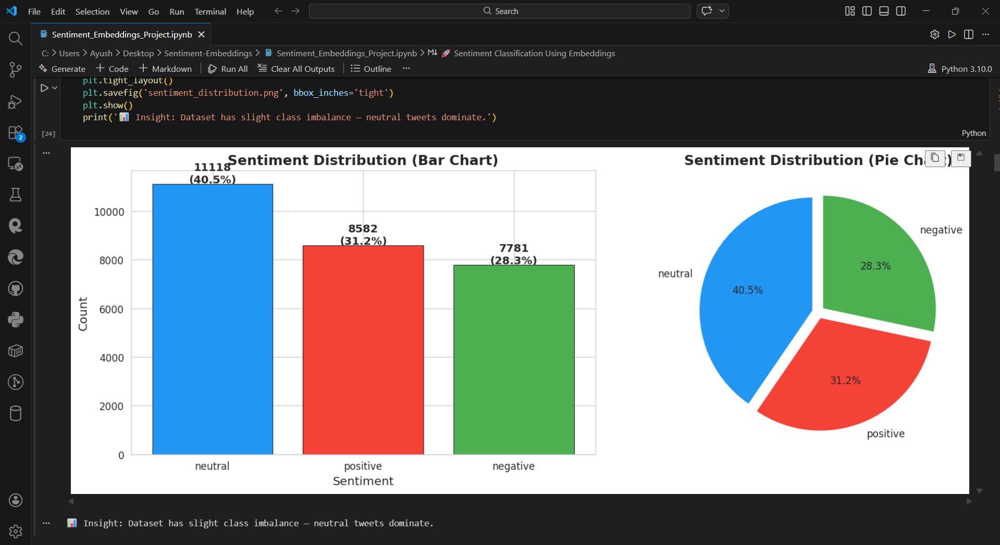
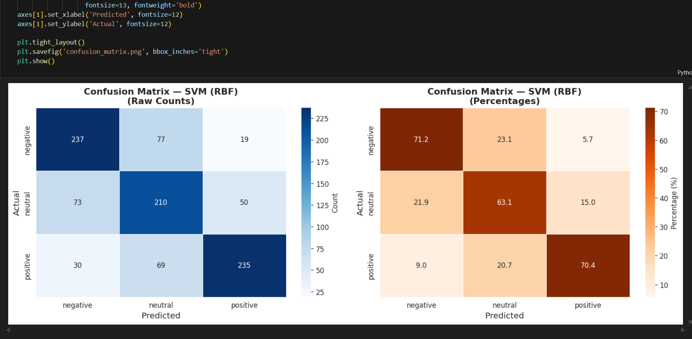
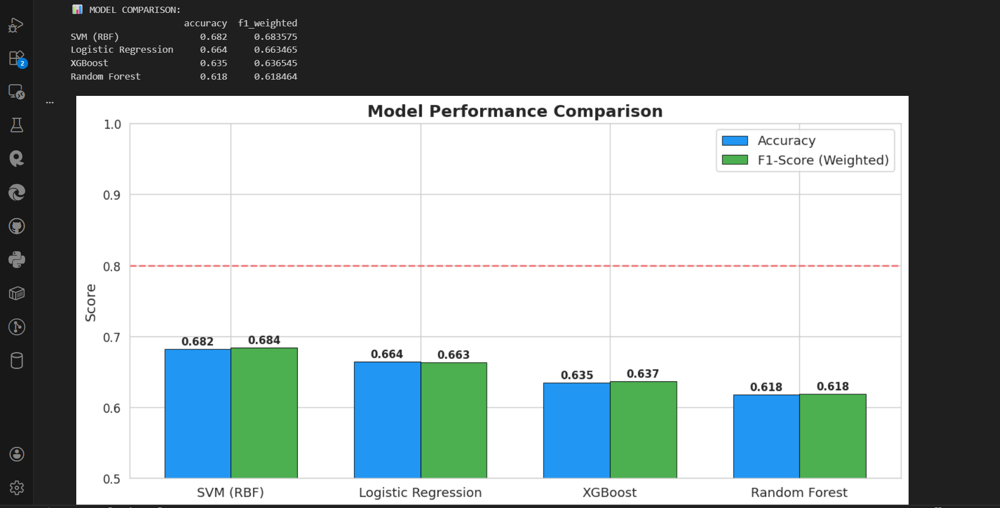
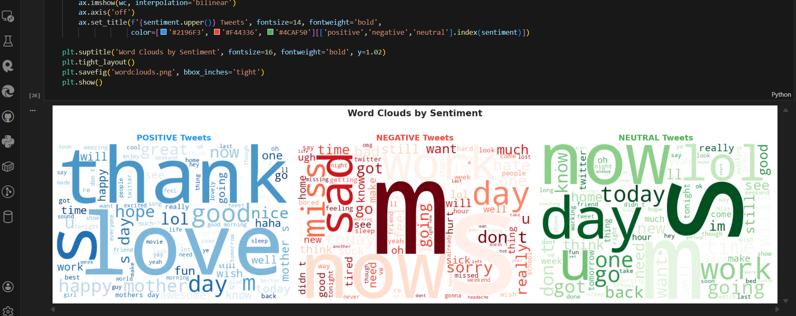
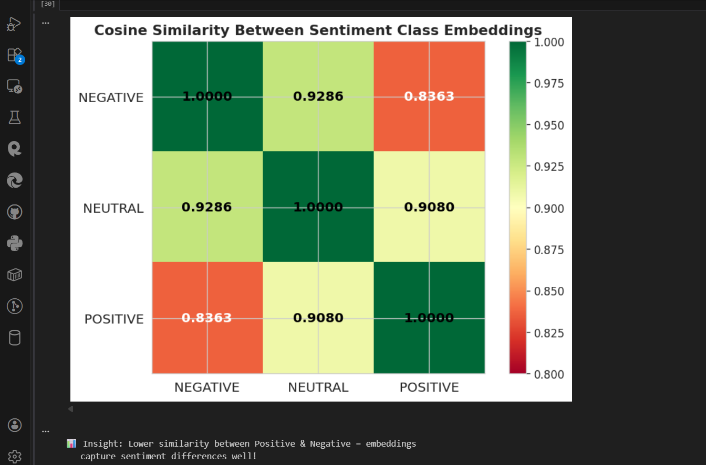
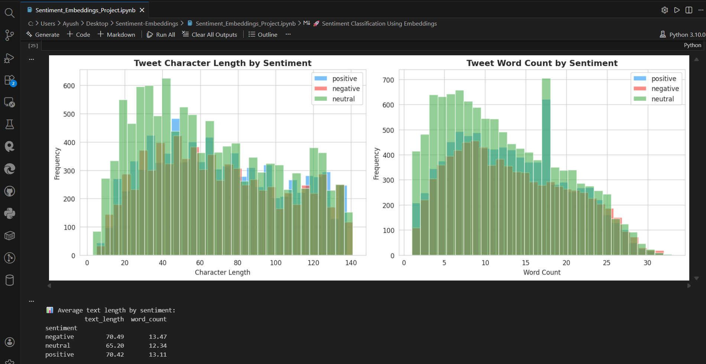

<p align="center">
  
</p>

<h1 align="center">🐦 Twitter Sentiment Analysis using MiniLM Embeddings 🚀</h1>

<p align="center">
  <a href="#">
    
  </a>
  <a href="#">
    
  </a>
  <a href="https://github.com/m1n1v1rus/Sentiment-Embeddings/stargazers">
    
  </a>
</p>


[](https://colab.research.google.com/drive/16x54MsCTOh3wqDIc3v9aS4fzghPs5xLd)

## 📌 Project Overview
Twitter sentiment analysis using **all-MiniLM-L6-v2** sentence embeddings. This project compares multiple machine learning models for sentiment classification (positive, negative, neutral) and includes comprehensive visualizations.

## ✨ Features
- **Text Preprocessing** - Complete tweet cleaning pipeline
- **Sentence Embeddings** - Using all-MiniLM-L6-v2 (384-dim vectors)
- **4 Classification Models** - Logistic Regression, XGBoost, SVM, Random Forest
- **Cosine Similarity Analysis** - Embedding space visualization
- **2D Visualization** - UMAP dimensionality reduction
- **Custom Predictions** - Test with your own tweets

## 📊 Results
| Model | Accuracy | F1-Score |
|-------|----------|----------|
| SVM (RBF) | 68.20% | 0.684 |
| Logistic Regression | 66.40% | 0.663 |
| XGBoost | 63.50% | 0.637 |
| Random Forest | 61.80% | 0.618 |

## 🖼️ Visualizations

### Sentiment Distribution


### Confusion Matrix (SVM - Best Model)


### Model Comparison


### Word Clouds


### Cosine Similarity Between Classes


### Tweet Length Analysis


## 🛠️ Tech Stack
- Python 3.x
- sentence-transformers
- scikit-learn
- XGBoost
- UMAP
- matplotlib, seaborn

---
## 🤝 Contributing

All contributions are welcome — bug fixes, feature enhancements, or documentation improvements!

Please give appropriate credit to the original author if you use or modify this tool in your own projects.

---

## 📜 License

This project is licensed under the **MIT License** — see the [LICENSE](LICENSE) file for details.

---

## 👤 Author

**Ayush Mani**  
🔗 GitHub: [@m1n1v1rus](https://github.com/m1n1v1rus)

---


## 🚀 Quick Start
```bash
# Clone repository
git clone https://github.com/m1n1v1rus/Sentiment-Embeddings-Project.git

# Install requirements
pip install -r requirements.txt

# Run notebook
jupyter notebook Sentiment_Embeddings_Project.ipynb
```
